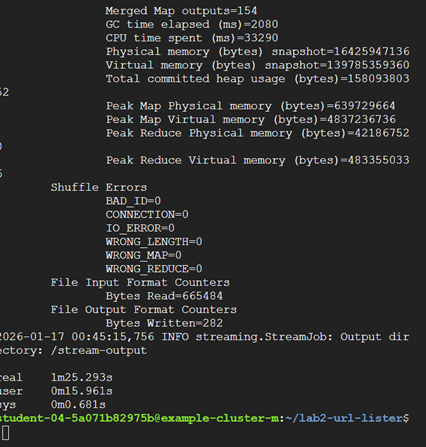
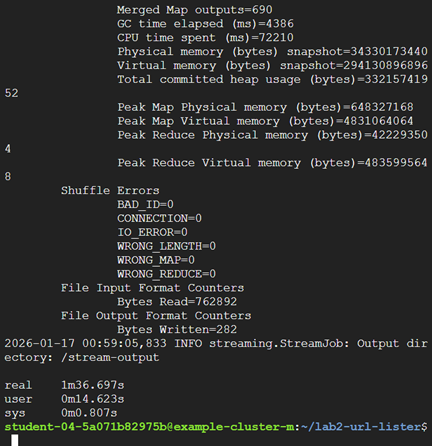

(Left: Two Nodes / Right:Four nodes)

1) What my program does

This lab modifies the Hadoop WordCount into UrlCount:

•	Input: A set of text files (HTML pages downloaded from Wiki).

•	Goal: Extract URLs from text and count how many times each URL appears.

•	Output requirement: Only output URLs whose total count is > 5.

Implementation summary (Hadoop Streaming / Python)

•	Mapper: scans each input line, extracts URLs using regex, and emits (url, 1) per match.

•	Reducer: sums counts for each url, and prints url count only if count > 5.

3) Software needed & how to run

•	Hadoop (provided by Dataproc)

•	Python 3 (using Hadoop Streaming)

After creating the Dataproc clusters with the required number of worker nodes in the specified region and assigning the appropriate IAM permissions to the master node, I connected to the cluster by SSH-ing into the Dataproc master node.

gcloud dataproc clusters ssh <CLUSTER_NAME> --region=<REGION>

This command opens a shell on the Dataproc master VM, where all subsequent commands were executed.

In the local coding environment, the command make prepare is provided to automatically download two Wikipedia pages and upload them to HDFS. However, in the Dataproc environment, I did not use make prepare. The main reason is that Dataproc already provides a running HDFS cluster, and it is more straightforward to place the input files directly into HDFS rather than relying on the Makefile to fetch external content again.

Instead, I manually created the input directory in HDFS and uploaded the two Wikipedia files directly. This achieves the same effect as make prepare, while giving more direct control over the input data location in the Dataproc cluster. By placing the files directly into HDFS, the data becomes immediately accessible to all worker nodes during job execution.
After the input files were prepared, I ran the make stream command in the Makefile 

This command launches the streaming pipeline that uses Mapper.py and Reducer.py.

During execution, Hadoop automatically splits the input files and distributes the work across the cluster. Each mapper processes a portion of the input data and outputs a simple count of how many times each URL appears in its assigned data. 

After all mapper outputs are collected, Hadoop groups together all counts that belong to the same URL and passes them to the reducer. The reducer then adds up these values to produce the final total count for each URL

(example (A,1) (A, 1) (B,1) -->(A,2) (B,1))

The condition that filters out URLs with five or fewer occurrences is applied only after this aggregation step, because the full count of a URL is only known at that point.
Finally, the reducer writes the filtered (url_counts > 5)results to the output directory in HDFS. 

5) Resources used & collaboration

Resources used

•	Hadoop Streaming examples

•	Python re documentation

•	GCP CloudSkillBoost Tutorial

Collaboration NA

7) Why WordCount’s Java Combiner can cause problems for UrlCount

The original Java WordCount implementation often uses a combiner to reduce shuffle traffic by doing local aggregation. This works because WordCount only performs summation and does not apply any global filtering, so partial results can be safely combined.
In this UrlCount lab, the requirement to output only URLs with a global count greater than five makes using a combiner unsafe. A combiner only sees partial counts from individual mappers and cannot determine the final total. If the reducer logic were reused as a combiner and applied the count > 5 condition early, some URLs could be dropped even though their global count exceeds five. Therefore, the filtering must be done only in the final reducer after all counts have been aggregated.

9) Execution time comparison: 2-node vs 4-node cluster

   
I ran the same UrlCount job twice using:

•	Cluster A: 1 master + 2 workers

•	Cluster B: 1 master + 4 workers

And use time hadoop jar to count the time

Results

•	Cluster A: 1 master + 2 workers  1m 25 sec

•	Cluster B: 1 master + 4 workers 1m 36 sec

Discussion / surprising outcomes

In my runs, 4-nodes did not make it faster. Below are the potential reasons

When the input data is relatively small, most of the total runtime is spent on job setup rather than actual computation. This includes starting the job, allocating containers, and scheduling tasks across the cluster. In this case, adding more worker nodes does not significantly reduce execution time because the overhead remains roughly the same.

In addition, the shuffle phase can become a bottleneck. While having more workers allows tasks to run in parallel, it can also increase the amount of data that needs to be transferred between nodes. Depending on how the data is partitioned, this extra network traffic can offset the benefits of parallelism.

Finally, performance is affected by data locality in HDFS. Jobs tend to run faster when tasks can read data from local disks on the same node. If tasks frequently need to read data from remote nodes due to replication placement, additional network access is required, which can slow down the job.

